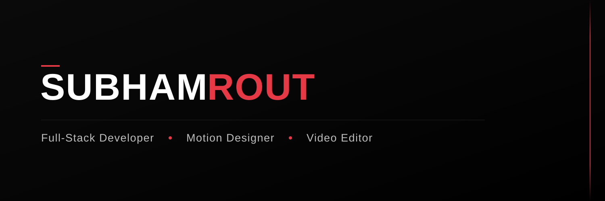

  

### Full-Stack Developer • Creative Developer • Motion Designer

Building digital experiences where software engineering, motion design, and cinematic storytelling come together.

  <a href="https://github.com/subhamrout818">GitHub</a> • <a href="mailto:for1s.contact@gmail.com">Email</a>

---

# 👨‍💻 About Me

I'm a Computer Science student and creative developer passionate about building products that don't just work—they feel great to use.

I enjoy combining modern web technologies with thoughtful UI/UX, motion design, and visual storytelling to create polished digital experiences. Alongside development, I work with professional video editing and motion graphics, which heavily influences how I approach interfaces and interactions.

I believe great products are built at the intersection of engineering, design, and creativity.

---

# 🚀 Currently Building & Learning

- ⚡ Full-Stack Web Applications
- 🎬 Motion-Driven User Interfaces
- 🧩 Scalable Backend Development
- 🎨 Premium SaaS Experiences
- 🎥 Commercial Video Editing & Motion Graphics
- 🌐 Modern Web Architecture

---

# 🛠 Tech Stack

### Frontend

### Backend

### Motion & Creative

### Creative Tools

---

# 🎥 Creative Experience

Outside software development, I create commercial and social media content using **DaVinci Resolve** and **Fusion**.

My editing workflow includes:

- Cinematic Editing
- Motion Graphics
- Color Grading
- Sound Design
- Commercial Advertisements
- Social Media Content
- Short-Form Storytelling
- Brand-Focused Visual Design

The principles I use while editing—timing, rhythm, composition, and pacing—also shape how I design web experiences.

---

# 🌟 Featured Project

## FOR1S

A premium SaaS landing page exploring cinematic storytelling through modern frontend engineering.

### Highlights

- Built with Next.js & TypeScript
- Modular component architecture
- GSAP & Framer Motion animations
- Smooth scrolling powered by Lenis
- Tailwind CSS
- Prisma ORM integration
- PostgreSQL backend foundation
- Responsive & accessibility-conscious design

**Repository**

➡️ https://github.com/subhamrout818/FOR1S

---

# 📈 GitHub Stats

---

# 🌱 Currently Learning

- System Design
- Authentication & Security
- React Three Fiber
- Cloud Deployment
- Performance Optimization
- Scalable Software Architecture

---

# 🤝 Let's Connect

I'm always interested in collaborating on projects involving:

- Full-Stack Development
- Creative Development
- UI/UX Engineering
- Motion Design
- Video Production

Feel free to connect or reach out.

---

### "Great experiences are engineered with logic and refined through creativity."

⭐ Thanks for visiting my profile!

